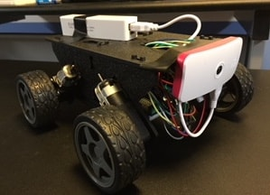

#  Fetchbot II

Fetchbot is a robotics project with the end goal of creating a roving bot that can chase, pick up, and return a ball.

## Fetchbot 2

The second version has the intermediate goal of chasing a laser pointer dot.

### Hardware

* Actobotics Whippersnapper Runt Rover Kit (chassis, wheels, motor) https://www.servocity.com/whippersnapper $29.99
* Raspberry Pi Zero W $10.00 ($5.00 on sale)
* H-bridge $12.99
* [Inland 2,600mAh Power Bank Battery Charger for Mobile Devices](http://www.microcenter.com/product/447265/2,600mAh_Power_Bank_Battery_Charger_for_Mobile_Devices) for remote power to the Raspberry Pi. $5.00
* 4 AA cells and case
* Raspberry Pi camera module http://www.microcenter.com/product/463611/8MP_Raspberry_Pi_Camera_Module $24.99
* Raspberry Pi Zero case http://www.microcenter.com/product/486577/Official_Raspberry_Pi_Zero_Case $4.99
* GPIO Hammer Header https://shop.pimoroni.com/products/gpio-hammer-header $6.50
* Jumper wires
* Tie wraps, tape, twist ties, and other miscellaneous kludge tools

Total: $89.46

### Software

* OS - Raspbian Stretch
* Development Language - Node.js 9.*
* GPIO library - [pigpio](https://www.npmjs.com/package/pigpio)
* [Socket.io](https://socket.io/) for web UI

I use [n](https://github.com/tj/n) to install and upgrade Node.js on the Raspberry Pi.
