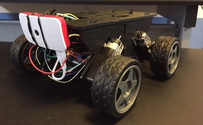

#  Fetchbot II

Fetchbot is a robotics project with the end goal of creating a roving bot that can chase, pick up, and return a ball.

## Fetchbot 2

This version has the goal of chasing a laser pointer dot.

### Hardware

* [Actobotics Whippersnapper Runt Rover Kit](https://www.servocity.com/whippersnapper) (chassis, wheels, motor)  $29.99
* Raspberry Pi Zero W $10.00 ($5.00 on sale)
* [Velleman L298N Dual Bridge DC Stepper Controller Board](http://www.microcenter.com/product/476363/L298N_Dual_Bridge_DC_Stepper_Controller_Board) $11.99
* [Inland 2,600mAh Power Bank Battery Charger for Mobile Devices](http://www.microcenter.com/product/447265/2,600mAh_Power_Bank_Battery_Charger_for_Mobile_Devices) for remote power to the Raspberry Pi. $5.00
* 4 AA cells and case
* [Raspberry Pi camera module](http://www.microcenter.com/product/463611/8MP_Raspberry_Pi_Camera_Module) $24.99
* [Raspberry Pi Zero case](http://www.microcenter.com/product/486577/Official_Raspberry_Pi_Zero_Case) $4.99
* [GPIO Hammer Header](https://shop.pimoroni.com/products/gpio-hammer-header) $6.50
* Jumper wires. I started with [M/M](http://www.microcenter.com/product/476368/30cm_40-Pin_M-M_Flat_Cable_Jumper_Wire) and [F/F](http://www.microcenter.com/product/476370/30cm_40-Pin_F-F_Flat_Cable_Jumper_Wire) because I can make an M/F with two of them.
* Tie wraps, electrical tape, twist ties, and other miscellaneous kludge tools.

Total: $88.46

With batteries, jumpers, and other parts you should plan on spending about $100.00 on this project, not including necessary tools like screwdrivers, a computer, and for setting up the Pi Zero: a keyboard, mouse or touchpad, HDMI monitor, and mini HDMI cable or adapter.

### Software

* OS - Raspbian Stretch
* Development Language - Node.js 9.*
* GPIO library - [pigpio](https://www.npmjs.com/package/pigpio)
* [Socket.io](https://socket.io/) for web UI

I use [n](https://github.com/tj/n) to install and upgrade Node.js on the Raspberry Pi.
